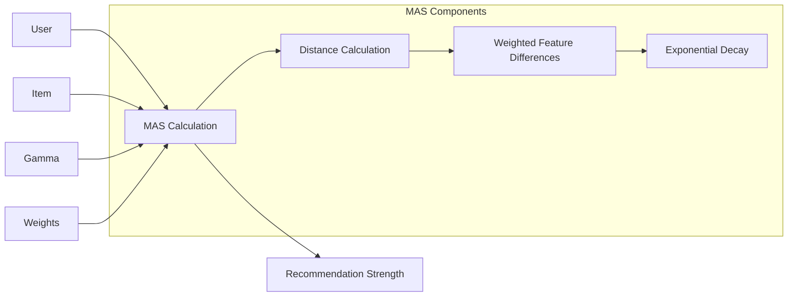
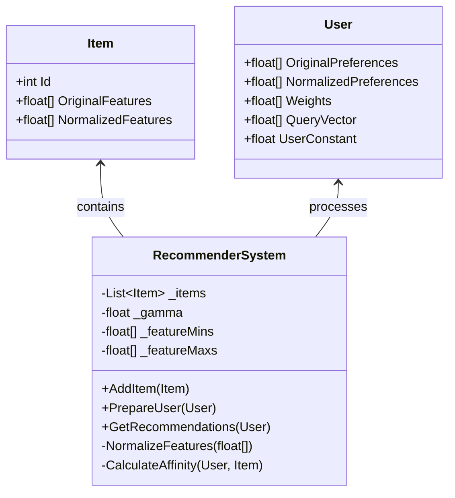
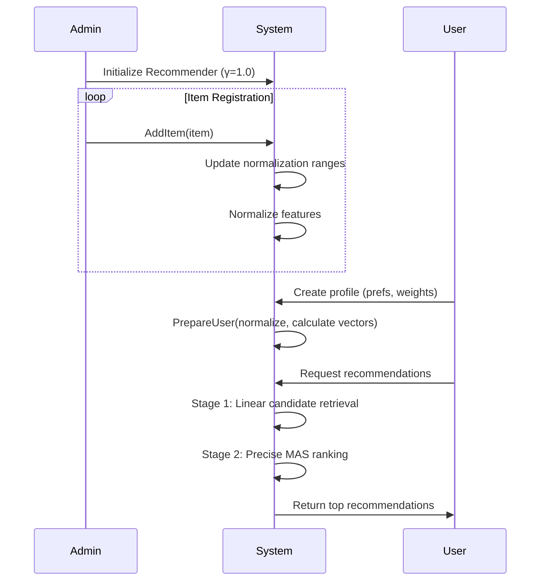

# Magnetic Recommender System

## Overview
This project implements a novel recommendation system based on the "magnetic attraction" metaphor, where users act as magnets that attract items (content/products) with varying strength based on feature similarity and personalized weights. The system calculates a Magnetic Affinity Score (MAS) to determine recommendation relevance and efficiently retrieves personalized suggestions through a two-stage retrieval and ranking process.

## Core Concept: Magnetic Affinity Score (MAS)

The heart of the system is the Magnetic Affinity Score, which mathematically models the "attraction force" between users and items:

```math
MAS(u, i) = \exp\left(-\gamma \cdot \sum_{j=1}^{n} w_j^{(u)} \cdot (i_j^{\text{norm}} - u_j^{\text{norm}})^2\right)
```

### Formula Components



1. **User Preferences** (u<sup>norm</sup>)
   - Normalized vector of user preferences (e.g., genre preference, language preference)
   - Range: [0, 1] after min-max normalization

2. **Item Features** (i<sup>norm</sup>)
   - Normalized vector of item characteristics
   - Same features and normalization as user preferences

3. **Personalized Weights** (w<sup>(u)</sup>)
   - Individual importance weights per feature for each user
   - Example: [3.0 (genre), 5.0 (language), 1.0 (rating)]
   - Determines what "type of magnet" the user is

4. **Distance Calculation**
   - Weighted Euclidean distance between user and item vectors
   - Smaller distance = stronger attraction

5. **Gamma** (γ)
   - Scaling parameter controlling "magnetic range"
   - Higher γ = sharper drop-off with distance

6. **Exponential Transformation**
   - Converts distance to attraction score (0-1]
   - Models magnetic force decay

## Key Features

- **Personalized Weighting**: Each user has unique feature importance weights
- **Dynamic Normalization**: Automatic min-max scaling to [0, 1] range
- **Two-Stage Retrieval**:
  1. Fast candidate retrieval using linear scoring
  2. Precise ranking with MAS calculation
- **Extensible Architecture**: Designed for integration with ANN libraries

## Implementation Details

### Class Structure



### Workflow



## Usage Example

```csharp
// Initialize system
var recommender = new RecommenderSystem(gamma: 1.0f);

// Add items
var items = new List<Item> {
    new Item { Id = 1, OriginalFeatures = new float[] { 2.0f, 0.0f, 4.5f } },
    new Item { Id = 2, OriginalFeatures = new float[] { 2.0f, 1.0f, 3.5f } }
};
items.ForEach(recommender.AddItem);

// Create user
var user = new User {
    OriginalPreferences = new float[] { 2.0f, 0.0f, 4.0f },
    Weights = new float[] { 3.0f, 5.0f, 1.0f }
};

// Get recommendations
recommender.PrepareUser(user);
var recommendations = recommender.GetRecommendations(user);
```

## Potential Improvements

1. **Efficient Retrieval**:
   - Integrate ANN libraries (FAISS, HNSW)
   - Implement approximate nearest neighbors search

2. **Dynamic Weight Adjustment**:
   ```csharp
   // Pseudocode for weight adaptation
   public void AdjustWeights(User user, Item interactedItem, float rating)
   {
       for (int i = 0; i < features.Length; i++) 
       {
           float error = Math.Abs(interactedItem.NormalizedFeatures[i] - 
                                user.NormalizedPreferences[i]);
           user.Weights[i] += learningRate * (rating - error);
       }
   }
   ```

3. **Hybrid Recommendation**:
   - Combine with collaborative filtering
   - Add content-based features

4. **Advanced Normalization**:
   - Z-score standardization
   - Robust scaling (outlier-resistant)

5. **Categorical Feature Support**:
   - Embedding layers
   - One-hot encoding integration

## Limitations and Considerations

- **Cold Start Problem**: New users need initial weight assignment
- **Computational Complexity**: Full scans impractical for large catalogs
- **Feature Engineering**: Requires careful feature selection
- **Bias Amplification**: May reinforce existing preferences
- **Dimensionality Issues**: High-dimensional spaces require special handling

## License

This project is licensed under the MIT License. See [LICENSE](LICENSE) for details.